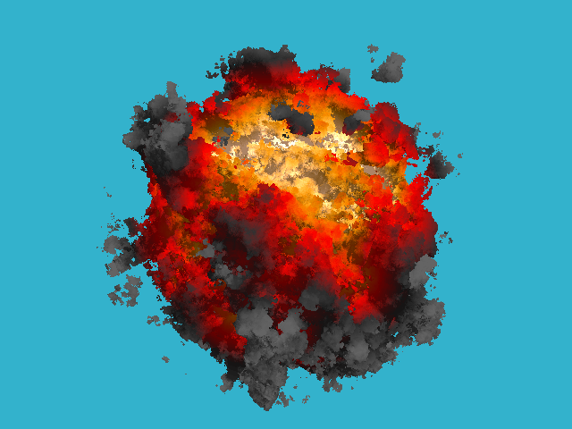

# tinykaboom (my version)

A small CPU ray marcher in C++20. Renders a procedural explosion as a single implicit surface — a sphere dented inwards by fractal noise — using sphere tracing, a fire gradient and diffuse shading, then writes a `.ppm` image.



## About

This is [ssloy's tinykaboom](https://github.com/ssloy/tinykaboom) — *"KABOOM! in 180 lines of bare C++"* — rewritten rather than reimplemented, and I want to be upfront about that. The algorithm is his, unchanged. What I changed is the presentation: clearer names, every formula written out in unevaluated form (`1.0f / 16.0f` instead of `0.0625f`), a comment above each non-obvious bit of maths, and his `geometry.h` swapped for my own `vec.hpp`.

It is deliberately not optimised. The point is that you can read it top to bottom and follow what is happening.

## How it works

The whole scene is one **signed distance function** (SDF):

```
signed_distance(p) = |p| - (sphere_radius + displacement(p))
displacement(p)    = -fbm(3.4 * p) * noise_amplitude
```

`fbm` sums four octaves of value noise, so the sphere's radius wobbles from point to point. The noise is never negative, so the displacement only ever carves *into* the sphere — which is what makes the bounding-sphere early-out safe.

Per pixel: build a camera ray, march along it until the SDF goes negative, use how deep the hit lies inside the original sphere as a "temperature" to look up a fire colour, and shade it with one point light using the normalised gradient of the SDF as the surface normal.

## Build & Run

```bash
g++ -std=c++20 -O2 main.cpp -o raymarcher
./raymarcher
```

Optionally with OpenMP, since the render loop is already annotated:

```bash
g++ -std=c++20 -O2 -fopenmp main.cpp -o raymarcher
```

Outputs `out.ppm` in the same folder. Open it with GIMP, IrfanView, or convert it:

```bash
magick out.ppm out.png
```

## Files

| File | What it does |
|---|---|
| `main.cpp` | Noise, fBm, fire palette, the SDF, sphere tracing, shading, render loop |
| `vec.hpp` | Templated N-dimensional vector math |

## Notes

- Resolution, FOV, camera, light and background are set at the top of `main()`.
- `sphere_radius` and `noise_amplitude` at the top of `main.cpp` control how big the explosion is and how deeply the noise dents it.
- The march is capped at 128 steps, each `max(0.1 * distance, 0.01)` long. There is no reflection or refraction — a hit ends the ray.
- The noise is intentionally the original's "bad" one, artifacts and all. Its smoothing step reads like a component-wise smoothstep but actually collapses to a dot product; see the comment in `value_noise()`, and the appendix at the bottom of `main.cpp` for the version that was probably intended.
- The hash function evaluates its sine in double precision on purpose. Multiplying by ~43758 shifts the result left by about 15 binary digits, so the fractional part comes from the sine's *last* bits — a float sine does not have enough of them, and the noise comes out visibly coarser.
